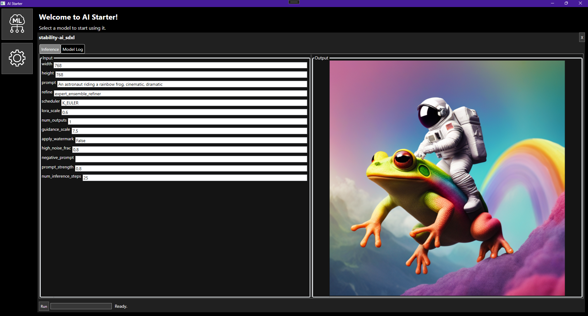

# 📦 AIStarter

**AIStarter** is a visual desktop tool for running AI models locally using Docker containers. Designed with ease of use in mind, it lets you browse a curated list of AI models (like face swapping or SDXL image generation), pull them via Docker, and interact with them through a simple graphical UI — no command line needed.

> ⚠️ This project is in **alpha** stage. Expect bugs and missing features.

---

## 🧠 Features

- 🧩 **Built-in model list** – select models from a growing catalog (currently: face swap, SDXL).
- 🐳 **Docker-powered** – each model runs in an isolated container.
- 🖥️ **Visual UI** – launch, configure, and interact with models directly from a WPF-based interface.
- 🔒 **Automatic port management** – uses local HTTP to pass files to models (admin rights may be requested).
- 📦 **No install wizard** – just download the release and run.

---

## 🚀 Getting Started

### ✅ Requirements

- **Windows 10/11**
- **Docker Desktop** (running and configured)
- Admin rights (only when needed to allow local HTTP access)

### 📥 Installation

1. Download the latest release from the [Releases](../../releases) page.
2. Unpack the `.zip` file wherever you like.
3. Run `AIStarter.exe`.

That’s it!

---

## 🔍 Roadmap

Planned features:

- 🔧 Add more AI models (e.g. voice, image-to-text, etc.)
- 🎛️ Improved model configuration panels
- ⚙️ GPU support & container management enhancements

---

## 📜 License

AIStarter is licensed under the [Apache License 2.0](LICENSE).

Created with ❤️ by **komorra**
